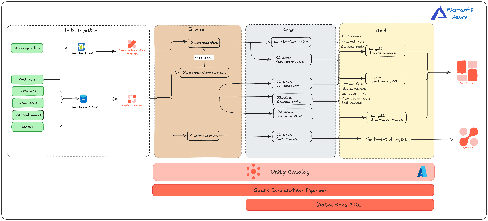
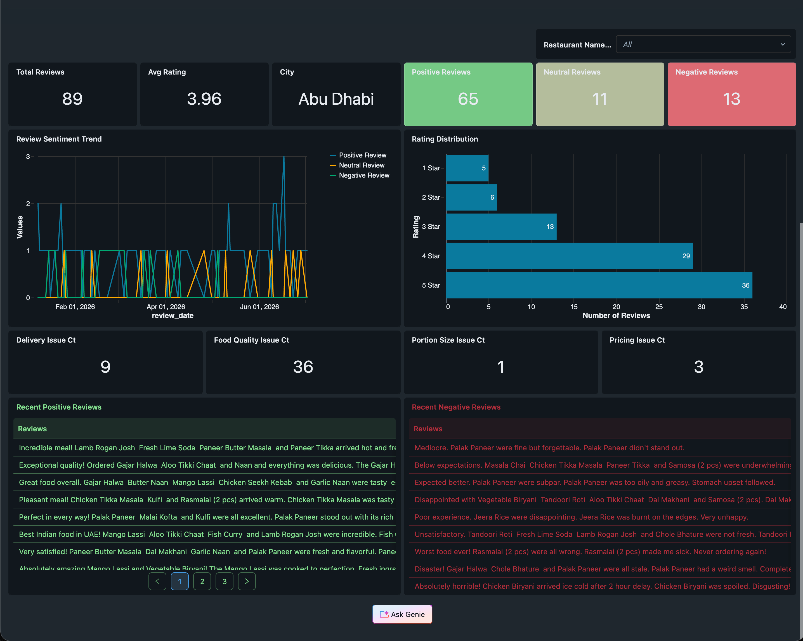
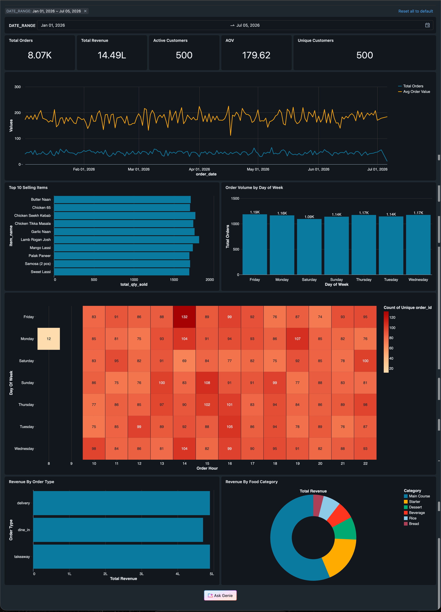
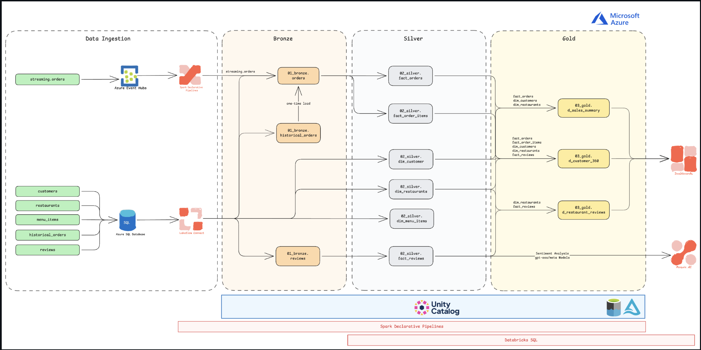
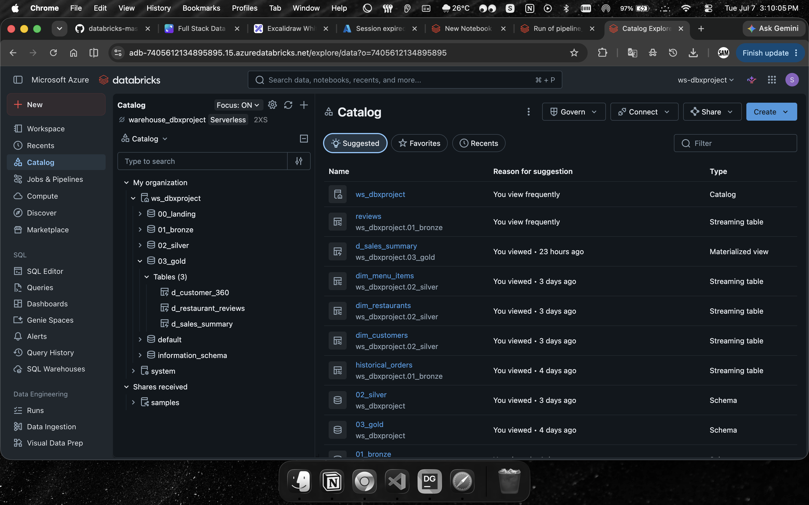
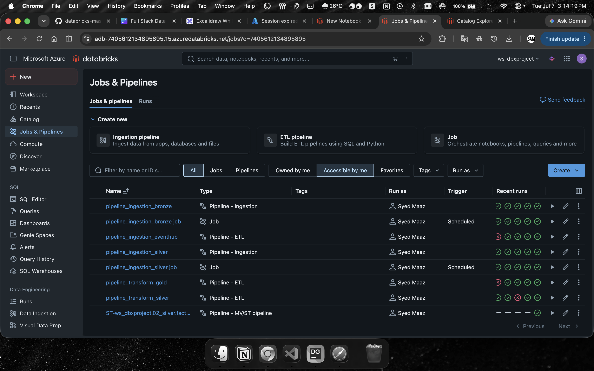
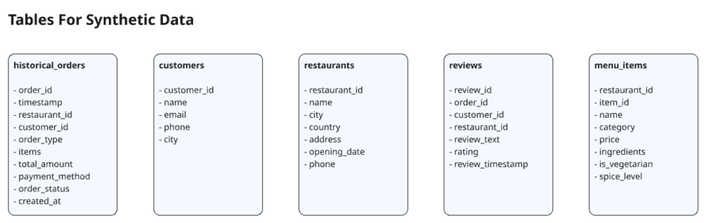
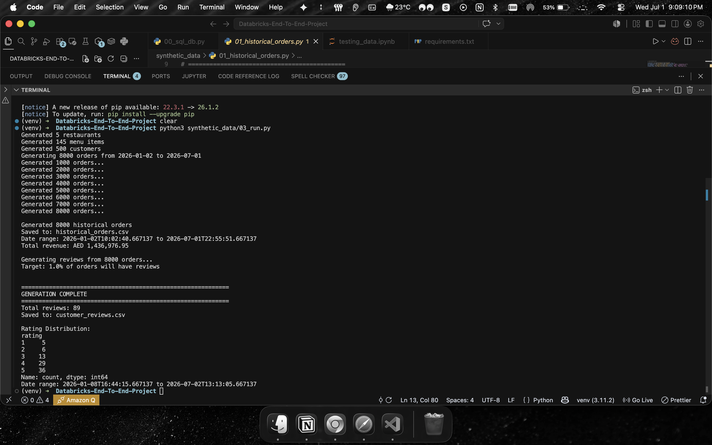

# 🍽️ Databricks Restaurant Chain Analytics Platform

> End-to-End Modern Data Engineering Project using Azure, Databricks, Apache Spark, Delta Lake, LakeFlow Connect, Event Hubs, Unity Catalog, and Mosaic AI.


# 📌 Project Overview

This project demonstrates a complete **modern Data Engineering pipeline** built on **Azure** and **Databricks**, simulating a real-world Restaurant Analytics Platform.

The project covers both **streaming** and **batch** ingestion, implements the **Medallion Architecture (Bronze → Silver → Gold)**, and produces AI-powered business dashboards using **Databricks SQL** and **Mosaic AI**.

---

# 🚀 Architecture

<p align="center">

</p>

---

# 🏗️ Tech Stack

### Cloud

- Microsoft Azure
- Azure Event Hubs
- Azure SQL Database

### Data Platform

- Databricks
- Unity Catalog
- Delta Lake
- LakeFlow Connect
- Spark Declarative Pipelines

### Processing

- Apache Spark
- PySpark
- Structured Streaming

### Analytics

- Databricks SQL
- AI/BI Dashboards
- Mosaic AI

### Language

- Python
- SQL

---

# 📂 Project Architecture

```
Azure Event Hub
        │
        ▼
Streaming Orders
        │
        ▼
Bronze Layer
        │
        ▼
Silver Layer
        │
        ▼
Gold Layer
        │
        ▼
AI / BI Dashboards
```

Batch Data

```
Azure SQL Database
        │
        ▼
LakeFlow Connect
        │
        ▼
Bronze Layer
```

---

# 📊 Medallion Architecture

## Bronze Layer

- Raw Streaming Orders
- Historical Orders
- Customer Reviews

Purpose

- Raw Data Storage
- Auditability
- Immutable Source

---

## Silver Layer

Cleaned & Transformed Data

- Fact Orders
- Fact Order Items
- Fact Reviews
- Customer Dimension
- Restaurant Dimension
- Menu Dimension

Purpose

- Data Cleaning
- Standardization
- Flatten Nested Data
- Data Quality

---

## Gold Layer

Business Ready Tables

- Sales Summary
- Customer 360
- Restaurant Review Analytics

Purpose

- Reporting
- Dashboards
- Business KPIs

---

# 🔄 Data Flow

```
Synthetic Data Generator

        │

        ▼

Azure Event Hub (Streaming)

        │

        ▼

Spark Streaming

        │

        ▼

Bronze Tables

        │

        ▼

Silver Transformations

        │

        ▼

Gold Aggregations

        │

        ▼

Databricks SQL Dashboards
```

---

# ⚙️ Features

✅ Streaming Data Ingestion

✅ Batch Data Ingestion

✅ Change Data Capture (CDC)

✅ Change Tracking

✅ Event Hub Integration

✅ LakeFlow Connect

✅ Unity Catalog

✅ Delta Lake

✅ Spark Declarative Pipelines

✅ Medallion Architecture

✅ Workflow Orchestration

✅ AI Sentiment Analysis

✅ Databricks SQL Dashboards

---

# 📈 Dashboards

## Restaurant Reviews Dashboard

<p align="center">

</p>

---

## Restaurant Chain Performance Dashboard 

<p align="center">

</p>

---

# 🖼️ Project Walkthrough


## Architecture

<p align="center">

</p>

---

<p align="center">

</p>

---


<p align="center">

</p>

---


<p align="center">

</p>

---


<p align="center">

</p>


# 📁 Repository Structure

```
.
├── diagrams/
├── pipelines/
├── synthetic_data/
├── notebooks/
├── sql/
├── README.md
```


# 🎯 Key Learnings

- Azure Event Hubs
- Azure SQL Database
- Unity Catalog
- Delta Lake
- LakeFlow Connect
- CDC & Change Tracking
- Apache Spark
- Structured Streaming
- Spark Declarative Pipelines
- Medallion Architecture
- Databricks SQL
- AI Dashboards
- Workflow Orchestration


# 🤝 Connect With Me

**Syed Ahmeduddin Maaz**

📧 Email: syedsam7676@gmail.com

💼 LinkedIn:
https://linkedin.com/in/maazzsd

🐙 GitHub:
https://github.com/SyedMaaz28
